# Postman API calls

It is very helpful to know what the responses of the different API calls are. So we can compare them to see which fields 
are useful to integrate into the application. Additionally, it helps create test data for the application and adding 
support for different vehicle types. 

## Import collections
We start with importing the collection in our repository, so you do not need to manually configure all the API calls that
this application uses.

1. Click on Import

2. Drop the `.json` files in this directory in the modal or select the folder containing them
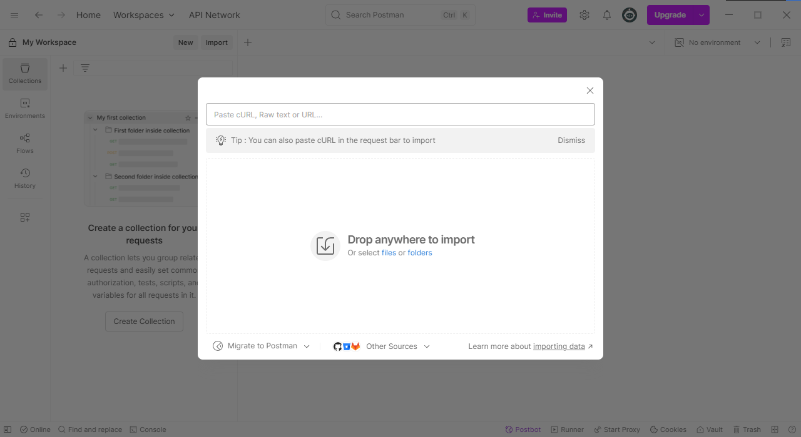
3. It should show you both JSON files in this directory. Click Import.
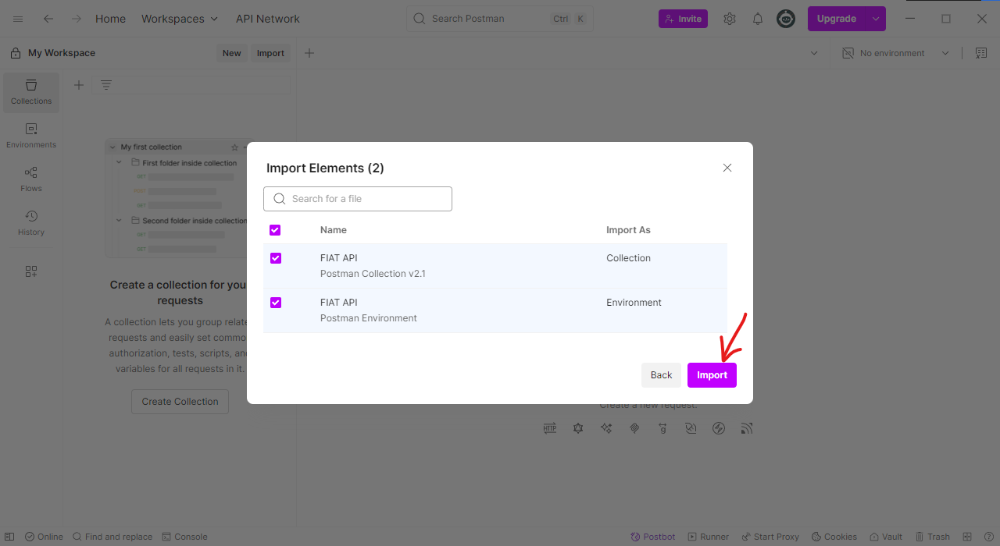
4. It should show you that both are imported

5. Go to `Environments` -> `FIAT API` and fill in `loginUser` and `loginPassword` with your own login credentials in 
6. both the `Initial value` and `Current value` columns
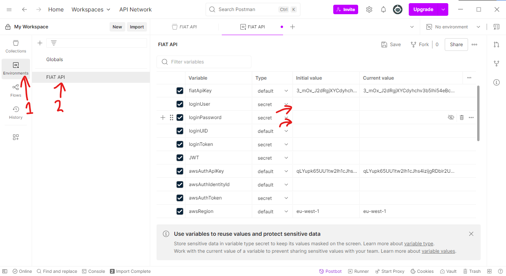
7. Click Save
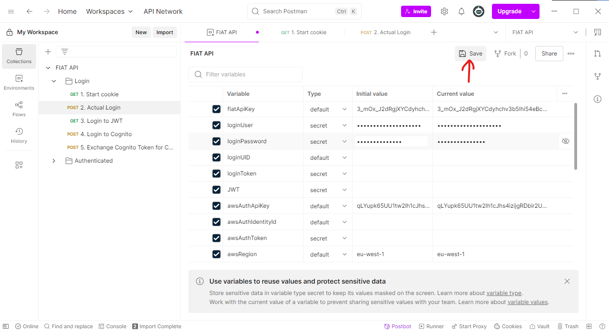

After this follow the next steps to log in to the API and let it generate the tokens and credentials for the actual API 
calls

## Login to the API
You will need to follow these steps every **time** you want to run any other API calls.

1. Click on the environment (dropdown) to change it
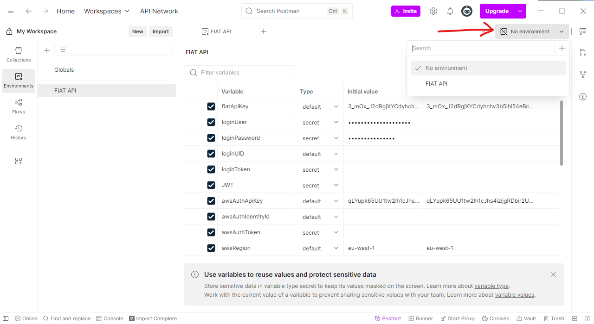
2. Click on FIAT API to set it to our environment

3. Go to `Collections` -> `FIAT API` -> `Login`
4. And click on `1. Start cookie`
5. When you hover over `{{fiatAPIKey}}` it should show you the API key of our environment
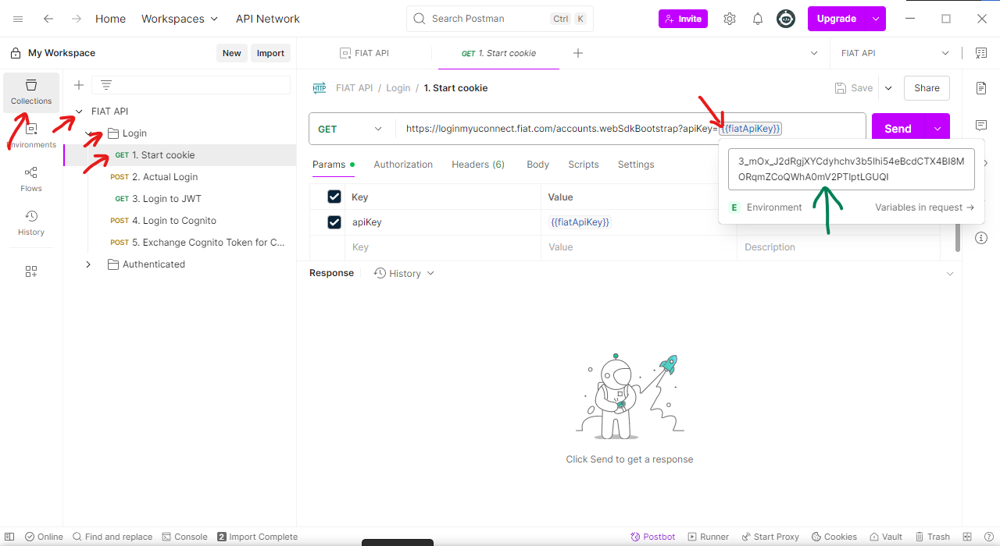
6. Click on Send to execute the first API call
7. It should show a 200 OK
8. The response is interpreted as `JavaScript` because the API isn't very nicely written. You can click on it and change 
9. it to JSON to make the response better readable
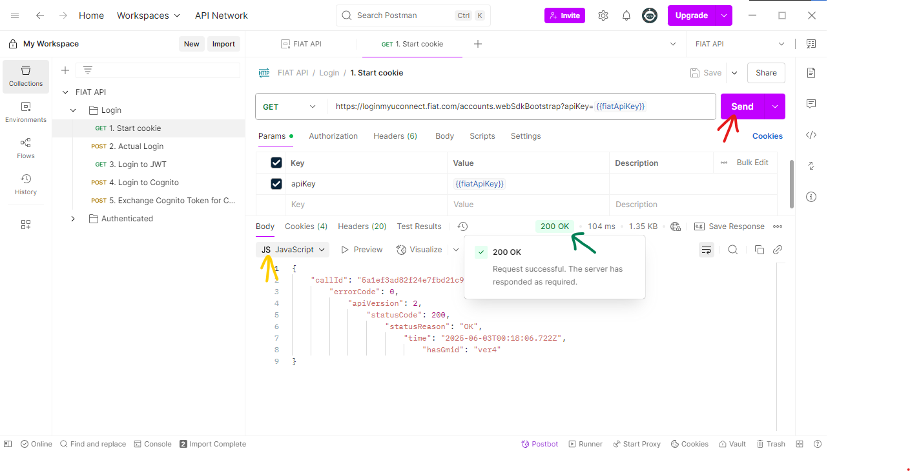
10. Click on `2. Actual Login`
11. Click on Send to log in with your username and password
12. Your response should be a `200 OK` and in the response you should have a `sessionInfo` property. If you do not 
13. double-check the credentials in your environment
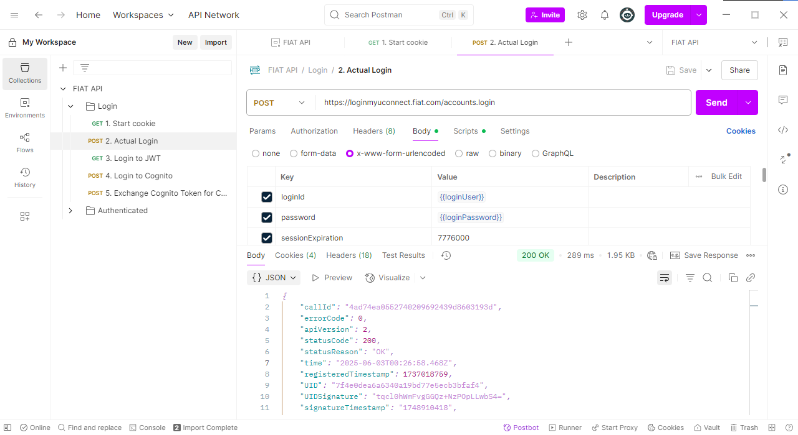
14. Now click through `3. Login to JWT`, `4. Login to Cognito` and `5. Exchange Cognito Token for Credentials` and 
15. sending each one of them in that order. Until you end at aa `200 OK` for 5.
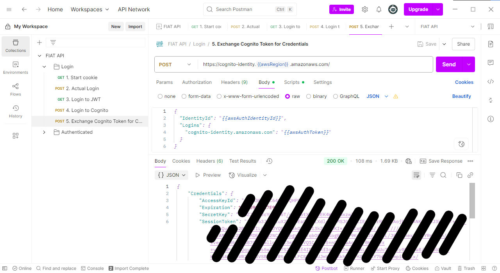

Continue with selecting your vehicle

## Select you vehicle
The last thing to do before running the other API calls is list the vehicles you have and selecting one VIN to run the 
rest of the API cals on.

1. Open the Authenticated folder
2. Click on `GET vehicles`
3. Click on `Send`
4. It will automatically save the VIN of the first vehicle in this response to your environment  
   _If you want to use a different vehicle change the `vehicleVIN` environment variable to the VIN of the vehicle you
   want to use instead._
   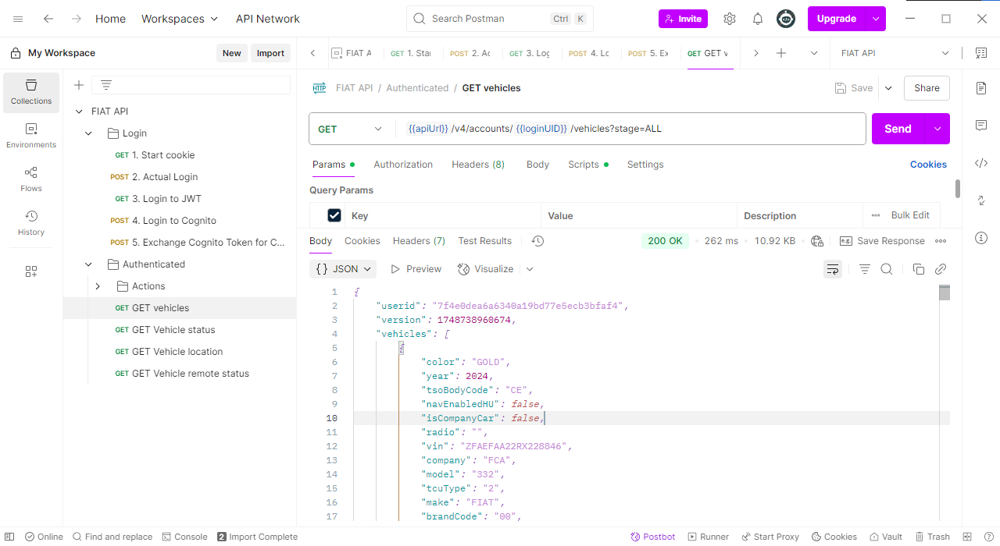

If you want to, please share the response of this API call with us. So we can use it to improve. 
See the Share response section, and please anonymize the VIN by replacing some or all characters with a uppercase `X`

## Share the response
After following the steps above, you should be able to run all the API calls in the collection. We would like to receive
the response to all the API calls in the `Authenticated` folder (optionally also including the ones in the `Actions` folder).

**BUT** we would not want you to share personal identifiable information. So please anonymize the response data 
before sharing with us.

To share, you can copy the contents of the Response body and paste it in a (new) issue inside a JSON code block. 
Or click on the three dots and then click `Save response to file`. Then name the file the same as the request and end it 
with `.json`.
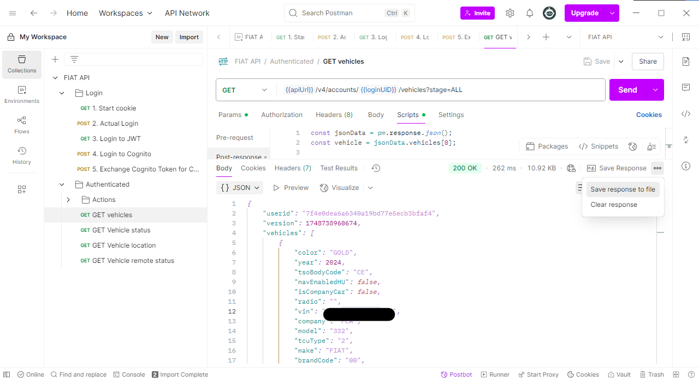

### Anonymize
Please do not share personal identifiable information. Always check if there is some data in the responses that you do 
not want to share with the world (since this is a public repository). Below you can find a list of properties that will 
most likely contain data you do not want to share. 

When the value is a string (ìn between double quotes `"`) either change it slightly by replacing some characters for 
the uppercase `X` or remove it completely and put `"REDACTED"` in its place. When it is a float (number with a decimal) 
of your location (latitude, longitude), please remove the last few digits/fractions from it to broaden the location. When 
it is an integer that you do not want to share (like your odometer), please replace them with similar but different numbers 
to keep the value close to real data but still anonymized. 

#### GET vehicles
- `vehicles[].vin`
- `vehicles[].nickname`

#### GET Vehicle status
- `vehicleInfo.odometer.odometer.value`
- `vehicleInfo.tripsInfo.trips[].totalDistance`
- `vehicleInfo.distanceToService.distanceToService.value`
- `evInfo.schedules[].startTime`
- `evInfo.schedules[].endTime`

#### GET Vehicle location
If you want to know that you made the latitude and longitude broad enough to not dox yourself, you can put it 
in Google Maps separated by a comma. 
- `longitude`
- `latitude`

#### GET Vehicle remote status
_None that I find personal_

#### All requests in Login folder
**The complete responses**. I expect almost all data in the response to contain data that you shouldn't share. 
